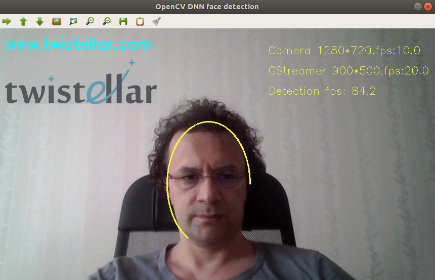

#  GPU-accelerated Docker container with OpenCV 4.5, Python 3.8 and GStreamer 

- [opencv](https://github.com/opencv/opencv) + [opencv_contrib](https://github.com/opencv/opencv_contrib)
- Python 3.8.0
- Ubuntu  18.04 LTS
- GStreamer  1.14.5
- FFMPEG
- CUDA  10.2
- NVIDIA GPU arch:  30 35 37 50 52 60 61 70 75 
- CUDA_ARCH_PTX = 75 (  The container does not work with **NVIDIA Ampere GPUs** `sm_86 `. For RTX 30 series, please see this [new repo](https://github.com/Fizmath/Docker-opencv-GPU-RTX_30))
- cuDNN:  7.6.5
- OpenCL
- Qt5::OpenGL  5.9.5
- Intel IPP and TBB
- UNCOMPRESSED SIZE  6.02 GB


Pull the image from here :

- [https://hub.docker.com/u/fizmath](https://hub.docker.com/u/fizmath)
   ```sh
   $ docker pull fizmath/gpu-opencv:latest
   ```

## How to run :

- With GPU 
  
    You need to install [NVIDIA Container Toolkit](https://docs.nvidia.com/datacenter/cloud-native/container-toolkit/install-guide.html) on your machine. Run the container by this command :

    ```
    $ docker run --gpus all -it --rm  fizmath/gpu-opencv:latest
    root@22067ad0cc87:/myapp#  
    ```

- With CPU :
    
    If no GPU available on your machine, yet you can use the container with [Docker](https://docs.docker.com/engine/install/)
    ```
    $ docker run -it --rm fizmath/gpu-opencv:latest
    root@cc00562d816e:/myapp# 
    ```
  
    for running the example ``.py`` files in this repo with CPU you should comment these two lines :
    
    ```
    net.setPreferableBackend(cv2.dnn.DNN_BACKEND_CUDA)
    net.setPreferableTarget(cv2.dnn.DNN_TARGET_CUDA)
    ```  

## Test with the examples in this repo :

1. Download this repo . The pretrained models are included, but you just need to download one of them [yolov4.weights](https://github.com/easyadin/Object-Detection-YOLOv4#pre-trained-models). And also no arg-parsing for the simplicity 

2. Unzip and set its directory in your machine as your docker volume :
   ```sh
    $ docker run --gpus all -it --rm -v  <your volume dir>:/myapp fizmath/gpu-opencv:latest
    root@771c5bcb2895:/myapp# ls
    Dockerfile  YOLOv4_cam.py  face_SSD.py     model_SSD   model_YOLOv4
    README.md   cv2_info.py    golden_axe.png  model_SURE  super_resolution.py
   ```
3. Print out OpenCV build info into a textfile, check out the produced output in your volume :
   ```sh
   root@771c5bcb2895:/myapp# python3 cv2_info.py
   ```
4.  Image Super-Resolution with OpenCV, Cuda and Docker :  the included [image](golden_axe.png), a SR image  `SURE_golden_axe.png`  will be produced in your volume by the following command  :
   ```sh
   root@771c5bcb2895:/myapp# python3 super_resolution.py 
   ```
   compare both images visually. If you run out of GPU memory , make inference by your CPU cores ; see the [.py](./super_resolution.py) file.
   
For the next two examples, you need to include these commands to docker run :

  - -e  DISPLAY=$DISPLAY  : this sends the display id from your machine to the container.

  - --device="/dev/video0:/dev/video0"  : this lets the container find the camera.

  - -v  /tmp/.X11-unix:/tmp/.X11-unix:rw  : this lets the container find the display via X server. In order to display the GUI with Docker, the X client in the Docker container needs to communicate with the host X server.

Note that I tested the above commands in UBUNTU. These may differ in other systems.

5.  Real-time face detection with OpenCV DNN, GStreamer, CUDA and Docker :
    . Before running the container type in your CMD :
    ```sh
    $ xhost +
    access control disabled, clients can connect from any host
    ```
    which allows the user to access the running X server. After being done with the examples type ``xhost -`` for the sake of security
    
    ```sh
     $ docker run --gpus all --rm -it -e DISPLAY=$DISPLAY -v  <volume dir>:/myapp -v /tmp/.X11-unix:/tmp/.X11-unix:rw --device="/dev/video0:/dev/video0"  fizmath/gpu-opencv:latest
     root@1be1f7efabf9:/myapp# python3 face_SSD.py
    ``` 

    

     I drew ***encircling ellipses*** instead of the common face ***bounding boxes*** . Click `q` to terminate the session. 


6.  Real-time object detection with YOLO v4, GStreamer, CUDA and Docker. First download [yolov4.weights](https://github.com/easyadin/Object-Detection-YOLOv4#pre-trained-models) and put it in it's [folder](model_YOLOv4). Following from the above:

    ```sh
    root@1be1f7efabf9:/myapp# python3 YOLOv4_cam.py 
    ```
    bring some objects from this [list](model_YOLOv4/coco.names) in front of your camera.

## Inspect the GStreamer API out of the OpenCV wrapper 

Type into the container's shell :

```sh
root@1be1f7efabf9:/myapp# gst-launch-1.0 videotestsrc ! videoconvert ! autovideosink
```
then a  GStreamer hello world window pops up . See the [documentation](https://gstreamer.freedesktop.org/documentation/tutorials/basic/gstreamer-tools.html?gi-language=python).

 

## OpenCV and  GStreamer debugging

Export OpenCV  [Log Levels ](https://docs.opencv.org/4.5.0/da/db0/namespacecv_1_1utils_1_1logging.html) or GStreamer [Debug Levels](https://gstreamer.freedesktop.org/documentation/tutorials/basic/debugging-tools.html?gi-language=python) into our container's shell . For example:

```sh
root@1be1f7efabf9:/myapp# export OPENCV_LOG_LEVEL=INFO 
```
or

```sh
root@1be1f7efabf9:/myapp# export GST_DEBUG=2
```

then run one of the examples and browse the output.

## Build your own image 
The [Dockerfile](Dockerfile) culprit for the image may not have a perfect structure . It is just my own assembly.
You may modify, upgrade and build a proper one for your requirements :

```bash
$ docker build -f Dockerfile -t <name>:<tag> .
```
It won't be that straight-forward, you will get some deprecation warnings and compatibility issues. <br /> To keep the image light-weight and compatible with old GPU architectures `SM_30 , SM_35 , SM_37` I implanted ``10.2-cudnn7-devel-ubuntu18.04`` as base 
image . 
